# Iniciación a la depuración en C++ con VSCode

## Introducción

En este tutorial vamos a ver cómo depurar en C++ con Visual Studio Code. Utilizaremos para ello el software de la práctica 2 de esta asignatura.

## Pre-requisitos

Para poder seguir este tutorial necesitaremos el IDE de Visual Studio Code y el software de la práctica ya instalado y compilado. Trabajaremos en un entorno Linux, más adelante se explica cómo hacerlo en MAC.

En primer lugar, debemos abrir la carpeta de la práctica desde la opción de `Archivo -> Abrir carpeta...` de Visual Studio Code. Es importante tener abierta la carpeta de la práctica para poder acceder a todos los archivos de la práctica, en lugar de abrir solo archivos sueltos.

Si al abrir la carpeta se nos muestra una imagen como la siguiente, debemos seleccionar la opción "Indeterminado", "Sin especificar" o "Unspecified" (dependiendo de la versión y el idioma nos saldrá con uno de estos nombres).

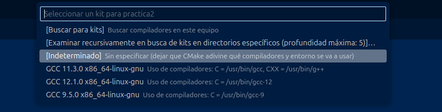

Con la carpeta abierta, debemos asegurarnos de tener instaladas todas las extensiones necesarias para compilar y depurar en C++. Para ello, debemos ir a la pestaña de `Extensiones` en la barra lateral izquierda y buscar las extensiones `C/C++` y `CMake Tools`. Si no las tenemos instaladas, debemos instalarlas.

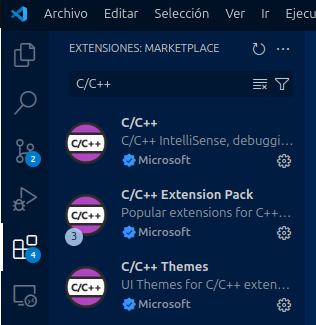
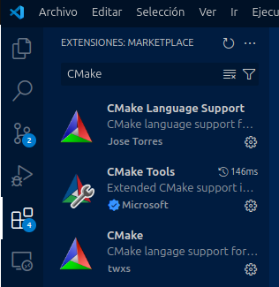

## El archivo launch.json

A continuación, vamos a colocar el archivo `launch.json` que tenemos en este mismo directorio en la carpeta oculta `.vscode` del directorio de la práctica. Es posible que de primeras no tengamos una carpeta con ese nombre, en cuyo caso tendremos que crearla antes. Podemos hacerlo a mano, usando un navegador de archivos o el propio explorador de VSCode, o a través de terminal. Para hacerlo por terminal, podemos ejecutar los siguientes comandos (asumiendo que estamos en el directorio raíz de la práctica):

```bash
mkdir .vscode
cp debug_tutorial/launch.json .vscode/
```

Echemos un vistazo rápido al archivo. Vemos que hay una serie de claves con valores asociados. Los que nos interesan principalmente son `program`, donde se encuentra el nombre del programa que queremos ejecutar (en este caso, `"{workspaceFolder}/practica2"`), y `args`, donde se encuentran los argumentos que queremos pasarle al programa. En este caso, no hay ninguno.

Nos puede interesar más adelante modificar estos parámetros, bien para usar el programa sin gráfica (`practica2SG`), o bien para lanzar cualquiera de los dos programas con argumentos específicos. Si queremos pasar argumentos, debemos añadirlos a la lista de `args` en el archivo `launch.json`. Los argumentos se añaden como elementos de una lista, separados por comas. Por ejemplo, para el ejemplo del tutorial parte 1, `./practica2 ./mapas/mapa30.map 0 0 17 5 0 17 17 0 3 3 0`, añadiríamos los argumentos de la siguiente forma:

```json
"args": ["./mapas/mapa30.map", "0", "0", "17", "5", "0", "17", "17", "0", "3", "3", "0"]
```

Siempre que queramos modificar este archivo, debemos modificar el que hemos copiado dentro de `.vscode`. Del original, el que está en el directorio `debug_tutorial`, nos podemos olvidar.

## Cambiando la localización por defecto de los ejecutables.

El software está diseñado para generar los ejecutables sobre el directorio raíz de la práctica. En cambio, VSCode por defecto asume que se generan en una carpeta `build/` dentro de dicho directorio. Si queremos compilar y depurar desde VSCode podemos modificar esta ruta por defecto, solo en este proyecto. Para ello:

1. Abrimos la paleta de comandos de VSCode con `Ctrl+Shift+P`.
2. Buscamos la opción `Workspace settings`, `Workspaces settings (JSON)`, `Preferencias: Abrir Configuración del Área de Trabajo`, `Preferencias: Abrir configuración de área de trabajo (JSON)` o similar.
3. Si hemos abierto el json, añadimos la siguiente línea:

```json
"cmake.buildDirectory": "${workspaceFolder}",
```

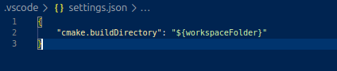

4. Si hemos abierto el editor de configuración, buscamos la opción `cmake.buildDirectory` y la modificamos para que quede como en el punto anterior (quitar la parte de `build/`).

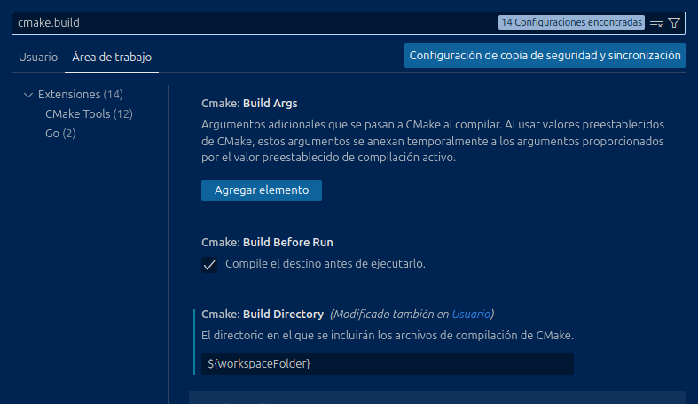

Es importante cambiar esta opción dentro de la configuración del área de trabajo y no en las configuraciones de usuario o globales, si no este cambio nos afectará a cualquier otro futuro proyecto que abramos en VSCode.

## Compilando directamente desde VSCode

Si hemos seguido los pasos anteriores, ya deberíamos tener todo listo para compilar y depurar desde VSCode. Para compilar, bastará con pulsar el botón que tenemos en la barra inferior, en el que pone "Versión de compilación".

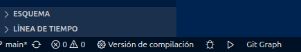

Si antes no nos salió el menú desplegable para seleccionar el kit de compilación, tendremos que hacerlo ahora. Nos aparecerá el menú desplegable descrito anteriormente, donde tendremos que elegir la opción "Indeterminado", "Sin especificar" o "Unspecified" (dependiendo de la versión y el idioma nos saldrá con uno de estos nombres).


Tras esto, cada vez que pulsemos el botón se nos compilará automáticamente el proyecto, sin necesidad de escribir `make` en la terminal.

Si por algún motivo no elegimos la opción correcta al mostrar la lista desplegable, podemos solucionarlo yéndonos al menú de CMake en la barra lateral izquierda. En la pestaña que se nos abre, buscamos la opción "Configurar", y pinchamos justo debajo para cambiar el kit. Esto nos volverá a mostrar la lista desplegable.

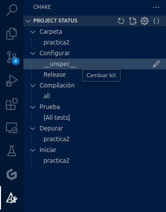

## Depurando en VSCode

Ya estamos en condiciones de empezar a depurar. Antes de nada, tenemos que asegurarnos de que nuestro programa se está compilando en modo `Debug`. El software está preparado para compilarse en dos modos diferentes:

- `Debug`: Se compila con información de depuración, lo que nos permite depurar el programa, poner breakpoints y trazar errores. En este modo las ejecuciones suelen ser bastante más lentas.
- `Release`: Se compila sin información de depuración y con optimizaciones, lo que hace que las ejecuciones sean más rápidas. No podemos depurar en este modo.

Para cambiar el modo de compilación, debemos ir a la pestaña de CMake en la barra lateral izquierda, y pinchar, dentro de la pestaña de "Configurar", en la opción "Debug" o "Release". Esto nos abrirá un menú desplegable donde podremos seleccionar el modo de compilación. Se recomienda usar `Release` cuando estéis ejecutando el software en serio, y `Debug` cuando estéis buscando errores o problemas en el código.

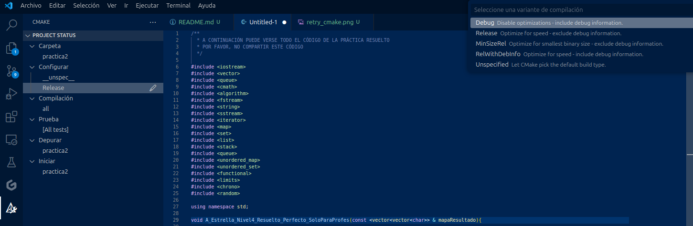

Tras esto, ya podemos empezar a depurar. Nos vamos de nuevo a la barra lateral izquierda, y pinchamos la pestaña de "Ejecución y depuración". Nos deberíamos encontrar en una pestaña como la que se muestra a continuación:


Si nos saliera una cosa diferente o nos dijera que tenemos que crear un archivo `launch.json`, debemos revisar los pasos anteriores. Seguramente, no hayamos copiado el archivo `launch.json` correctamente en la carpeta `.vscode` de la práctica.

Estando en este menú solo tenemos que darle al botón del play, y se nos abrirá el programa. Tanto el programa que se ejecute como los argumentos que se le pasen son los que tengamos especificados en el archivo `launch.json`. Cuando queramos depurar con otros parámetros, tendremos que modificar este archivo.

## Breakpoints y excepciones

Una vez que hemos abierto el programa, podemos empezar a depurar. Para ello, podemos poner breakpoints en el código. Un breakpoint es un punto en el código donde queremos que el programa se detenga para poder inspeccionar el estado de las variables y la ejecución del programa. Para poner un breakpoint, simplemente debemos pinchar en la barra lateral izquierda, en la columna donde aparecen los números de línea. Un punto rojo aparecerá en la línea donde hayamos pinchado, indicando que hemos puesto un breakpoint. Si queremos quitarlo, simplemente volvemos a pinchar en la misma línea.

Con un breakpoint puesto, cuando ejecutemos el programa en modo `Debug` desde el menú de depuración, el programa se nos parará cuando llegue a la línea de código con el breakpoint. Hagamos una prueba colocando un breakpoint al principio del `think`, en `rescatador.cpp`:

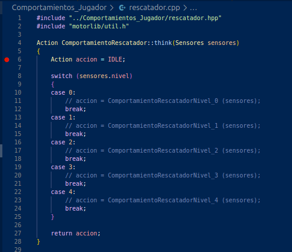

Ahora ejecutamos desde la ventana de depuración, cargamos un mapa y un nivel, y le damos a "Paso". En ese momento se entrará en el método `think` y el programa se nos parará en el breakpoint. Nos encontraremos en la situación de la siguiente imagen:

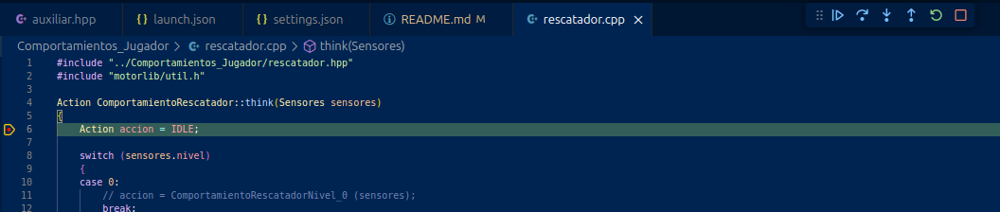

Vemos también que nos aparece una barra de herramientas en la parte superior con distintos botones. Estos botones nos permiten ir controlando la depuración paso a paso. De izquierda a derecha, son:
- **Continuar.** Continúa la ejecución del programa hasta el siguiente breakpoint.
- **Paso a paso por procedimientos.** Ejecuta la siguiente línea de código, pero si se llama a una función, se ejecuta toda la función sin parar. Es decir, no se entra en las funciones.
- **Paso a paso por instrucciones.** Ejecuta la siguiente instrucción de código, aunque sea dentro de una función. Es decir, se entra en las funciones.
- **Salir de la depuración.** Sale hasta la función que ha llamado a la función actual.
- **Reiniciar.** Reinicia la depuración del programa.
- **Detener.** Detiene la ejecución del programa.

Cuando tengáis código implementado del tutorial podéis experimentar con los distintos botones para comprender mejor su funcionamiento.

Cuando la ejecución está detenida en un breakpoint, podemos consultar mucha información:
- **Variables e inspección.** En la parte izquierda de la pantalla, en la pestaña de "Variables", podemos ver el valor de las variables en ese momento. Si pinchamos en una variable, podemos ver su valor y su tipo. Si pinchamos en un objeto, podemos ver sus atributos y métodos. Podemos añadir las variables que queramos a la lista de inspección, para tenerlas siempre a mano.
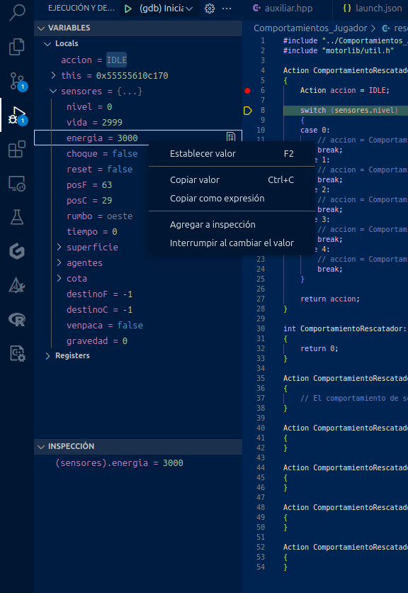

- **Pila de llamadas.** En la parte inferior izquierda, en la pestaña de "Pila de llamadas", podemos ver la pila de llamadas en ese momento. Es decir, las funciones que se han llamado hasta llegar a ese punto. Si pinchamos en una función, podemos ver las variables locales de esa función y su posición en el código antes de que se llamara a la función actual.
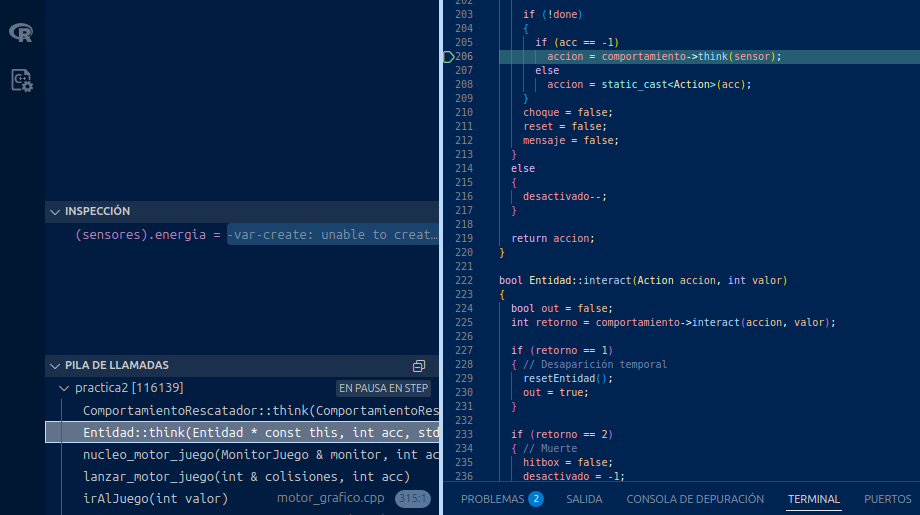
- **Consola de depuración.** En la parte inferior, en la pestaña de "Consola de depuración", podemos consultar el estado de las variables de forma más dinámica. Podemos escribir expresiones de C++ y ver su valor en ese momento. Por ejemplo, si queremos consultar una posición concreta del sensor de terreno en el momento actual:
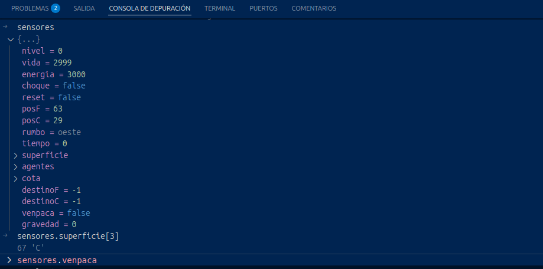

También, podemos poner condiciones en los breakpoints, para que no salten cada vez que lleguemos a esa línea de código, sino que solo si se cumplen ciertas condiciones. Por ejemplo, si queremos que el breakpoint solo salte si estoy en un puesto base (casilla 'X'), podemos configurarlo pinchando en el breakpoint con el botón derecho y seleccionando "Editar punto de interrupción". En el cuadro que se nos abre, podemos escribir la condición que queramos:

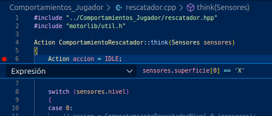

Por último, si nuestro programa finaliza por un error mientras estemos depurando, tendremos la oportunidad de consultar el estado del programa en ese momento. El programa se nos parará, como si fuera un breakpoint, en el momento de la excepción. Podremos consultar el estado de las variables y la pila de llamadas también, y ver qué ha pasado.
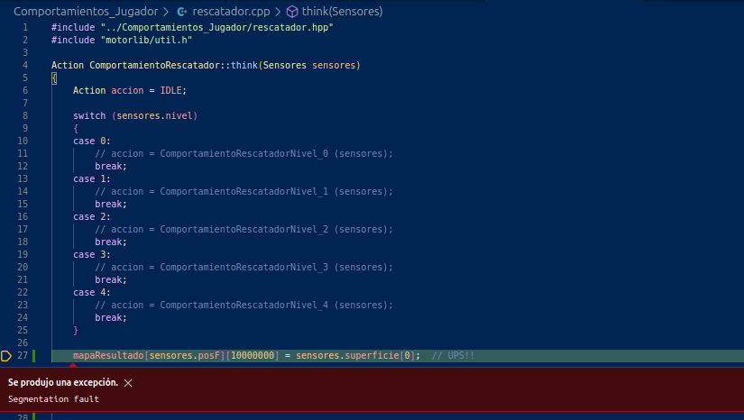

Recuerda consultar bien las variables y su valor cuando se producen este tipo de errores, ya que normalmente el error no será tan evidente. Tienes la consola de depuración también para ayudarte. En muchas ocasiones, el error saltará en una clase o fichero de clases internas de C++ que no corresponde a los de la práctica. Pero si miras la pila de llamadas, podrás comprobar que a la función que ha causado el error se ha llamado desde una función de tu código. ¡Con todas estas herramientas no habrá error que se te resista!

Con esto concluye el tutorial de depuración en C++ con VSCode. Hemos visto una pequeña parte de todo lo que se puede hacer para depurar. Si tienes alguna duda, no dudes en preguntar a tus profesores.

## Preguntas frecuentes

- **No me coge el programa los breakpoint, me salen grises cuando le doy a ejecutar.** Posiblemente o te falte poner el modo `Debug`, o el IDE siga creyendo que tiene que leer los archivos de la carpeta `build/`. Asegúrate de que está el modo `Debug` y que has cambiado la configuración del espacio de trabajo para que no use el directorio `build`. Después, borra la carpeta `build/` si existe, los archivos `Makefile` y `CMakeCache.txt`, y vuelve a ejecutar el script `install.sh`. Al acabar esto, vuelve a probar con el botón de compilar, y una vez compilado vuelve a probar con los breakpoints.

## El camino difícil: depurando en MAC

Próximamente...